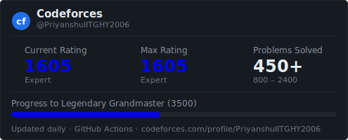
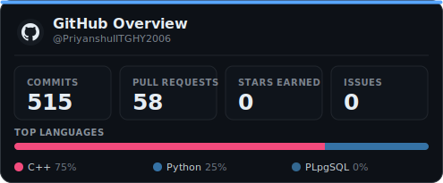

# Priyanshu Debnath

**B.Tech Electronics & Electrical Engineering** · Minor in Mathematics · **IIT Guwahati** — CPI 9.52

 

> First-year EEE undergraduate at IIT Guwahati. I compete on Codeforces, write mostly C++, and build things that apply the same ideas — ML pipelines, graph algorithms, and stochastic models.

### &nbsp;Tech Stack

---

## &nbsp;Competitive Programming

**Codeforces Expert** &nbsp;·&nbsp; max rating **1605** &nbsp;·&nbsp; **CodeChef 2-Star**
**450+** accepted solutions across difficulty bands 800–2400, indexed automatically by rating and tag.

---

## &nbsp;Projects

**[Hackathon-Squad](https://github.com/PriyanshuIITGHY2006/Hackathon-Squad)** — NP-hard Maximum Weight Independent Set solver in C++. Kernelization reduction rules → Nemhauser-Trotter LP relaxation via Dinic max-flow → hybrid exact tree-DP / Iterated Local Search (PROBE 1→k swap). Anytime design with SIGTERM guards under a 290s limit. 23/23 valid benchmark solutions, beating expected values on 8 cases.

**[Prag-Dristi](https://github.com/PriyanshuIITGHY2006/Prag-Dristi)** — 7-day Brahmaputra river discharge forecasting on 23 years of ERA5/GloFAS reanalysis. LSTM encoder-decoder with Bahdanau attention; flood-weighted MSE for the &lt;8% class imbalance. NSE = 0.924, KGE = 0.920 on held-out years. FastAPI backend, Streamlit dashboard for real-time monitoring.

**[codeforces-solutions](https://github.com/PriyanshuIITGHY2006/codeforces-solutions)** — 450+ accepted solutions indexed by rating and tag, 800–2400.

---

## &nbsp;Achievements

- **JEE Advanced 2025** — AIR 1941, top 1% among 1.5 lakh candidates
- **JEE Main 2025** — 99.69 percentile, AIR 4738
- **Kriti 2026** — Gold Medal, Artificial Intelligence Challenge, IIT Guwahati
- **AMS Derive 2026** — Rank 199, PRIOR Round (Jane Street · QRT)

---

## &nbsp;GitHub Stats

---

Electronics · Mathematics · Algorithms &nbsp;·&nbsp; stat cards auto-updated daily via GitHub Actions

